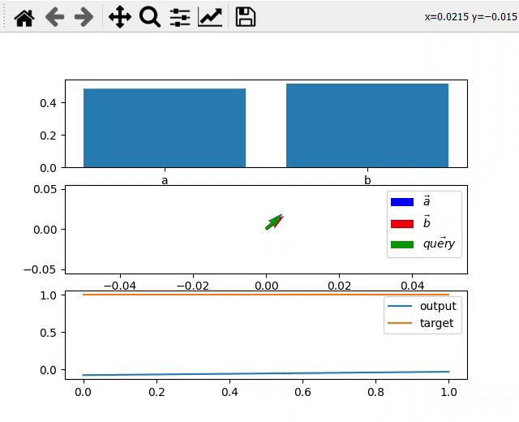

# attention-visualized
scaled dot-product attention visualization (single head) (as described in Attention Is All You Need arXiv:1706.03762) 
The value behind b is -1 and the value behind a is 1; the goal is to find a routing using scaled dot-product attention that gets the output 1 (target).  

Subplots:  
The first subplot shows how much is attended to each parameter a (value: 1) and b (value: -1).  
The second subplot shows the key vectors corresponding to a,b and the query (embedding).  
The final subplot shows the output and the target line.  
